# r/Wallstreetbets: A Hitchhiker’s Guide to the Moon or to the Ground? 

## Purpose of the project
This project seeks to preliminarily explore the relationship between the sentiment espoused on the popular internet forum, Reddit’s r/Wallstreetbets subreddit, and the stock market (as a proxy for the US economy) and compare it to that of the Federal Open Market Committee (FOMC) statements, one year from the start of the latest interest rate hike cycle in March 2022. Known for risky stock bets, edgy humor, and viral popularity during the COVID-19 Pandemic, we wanted to know whether the Redditors on r/Wallstreetbets have an accurate gauge of the macroeconomy – is it a Hitchhiker’s Guide to the Moon or to the ground?

We expect to see a minimum or even negative correlation between Reddit sentiments and stock closing prices and a positive correlation between FOMC statements sentiments and stock closing prices.

## Method and data processing
To answer the above question, we decided to conduct sentiment analysis and calculate compound sentiment scores (mean compound sentiment scores for Reddit posts) for each data entry and run regressions on stock indices S&P 500/Dow Jones/NASDAQ (proxy of the US economy). 

We  scraped  FOMC  statements  from  the  Federal  Reserve’s  official  website (https://www.federalreserve.gov/newsevents/pressreleases.htm)  and  posts  from  the  Reddit subreddit r/Wallstreetbets (https://www.reddit.com/r/wallstreetbets/ ) between March 1st, 2022 to March 31st, 2023. The start date was chosen since the FED started announcing a series of Federal Funds Rate hikes to ease the post-pandemic inflation not seen in decades.  

In general, the scraping and cleaning were straightforward, with only streamlining datetime objects causing minor hurdles; the recent changes in Reddit’s API policy didn’t affect our scraping effort. The FOMC statements were scraped using the selenium package, while the Reddit posts were scraped using the praw package. Considering the amount of Reddit posts irrelevant to the macroeconomic focus of this project, we applied keywords ('inflation,' 'interest rate,' 'unemployment rate,' 'forecast,' 'recession') while scraping. The stock closing prices were scraped from Yahoo! finance using the yfinance package. 

In the end, we obtained 9 FOMC statements and 539 Reddit posts, as well as 273 entries for stock closing prices. The raw data underwent a series of preprocessing steps to optimize its suitability for subsequent analysis. Stopwords were removed, and lemmatization applied to reduce words to their base forms. Subsequently, sentiment analysis was conducted on the preprocessed text utilizing the VADER sentiment analyzer. The compound score was then utilized to categorize the data into three sentiments: 'positive,' 'neutral,' or 'negative.' These sentiments serve as key metrics for generating various visualizations. In addition, a simple sentiment analysis model was constructed using a Support Vector Machine (SVM) classifier.  

While the project initially requested the use of Shiny, we discovered that Dash offers a better dashboard creation experience. Currently, we leverage both Shiny (codes provided in my\_app) and Dash (codes provided in dash\_app) to craft dynamic dashboards showcasing our findings and interactive graphs. With Dash, we extend our capabilities by creating additional sections, including the integration of raw data we've scraped and an interactive text predictions section for users to engage with. Moreover, we explore the deployment of our Dash application to Render, a unified cloud platform that streamlines the building and running of all our apps. Links are provided in a latter section. 

## Observations 

The observations and data visualization outcomes are presented in the form of two dashboards[^1]; the graphs are attached in the Appendix for ease of reference. 

### 1. Line graphs 

We plotted the compound sentiments and monthly mean compound sentiments for Reddit posts on top of the major stock indices. We also used OLS to estimate the correlation between the data set sentiments and the closing prices. All the models (FOMC/Reddit on S&P 500/Dow Jones/NASDAQ) are sadly not statistically significant, which is similar to what we expected to see for the Reddit posts. Interestingly, the R-squared from the FOMC-stock indices pairs is higher than that of Reddit-stock indices pairs. Regression results are saved as Charts 1-6 in the Appendix section. 

### 2. Word cloud 

The word cloud visually represents the most frequently occurring keywords in the statements and posts we extracted. Notably, the FOMC statement features a prevalence of formal policy vocabulary and technical jargon, including terms like monetary policy, federal fund rate, and (rate) target. In contrast, the Reddit posts' word cloud emphasizes topics such as inflation, recession, market, company, and price, which hold more individual-level significance  due to their direct impact on personal circumstances. 

### 3. Aggregate sentiment 

Aggregately, the FOMC statements show a mean compound score of 0.0972, while Reddit posts have a score of -0.0432, showing the difference in sentiments among the two data sets. 

### 4. Histogram of compound scores 

These histograms show the compound sentiment scores for the two data sets. We can see that the sentiments expressed within the FOMC statement are less extreme than those in Reddit posts. 

### 5. Time series analysis 

These graphs show the compound scores for both data sets. We can see that the FOMC statements show the lowest compound sentiment scores between August 2022 and January 2023, while Reddit dipped lowest in May 2022 and then went on a generally upward trend. 

### 6. Top 20 Bigrams 

These graphs show the top bigrams by frequency in both data sets. Similar to the word cloud results, we can see that the FOMC statements contain more official and technical jargon, while the Reddit posts hold more words relevant to individuals' daily lives. 

## Conclusions 

Like our initial expectation, Reddit posts’ correlations with stock closing prices aren’t significant or large. On the other hand, despite line graphs seemingly showing co-movement between sentiments expressed in FOMC statements and stock closing prices, the relationship seems to be not robust statistically. These could be explained by some of the limitations we describe below. 

## Limitations of this project 

Despite the interesting results we observed, several limitations could be improved upon. 

- Data size: since we only considered the official FOMC statements under the monetary policy category  on  FED’s  website,  only  9  observations  were  available  for  analysis.  Further explorations could consider exploring the other released meeting minutes, yet these are usually published in PDFs, thus complicated text processing is required. 
- Asynchronous effect: this preliminary project only takes account of synchronous correlation. Future projects with similar aims should consider the asynchronous effects of independent variables. 
- Sentiment Analysis and Text Predictions model: Despite our efforts to build the model, the model's accuracy is reported to be around 70%, indicating room for improvement. Our model did not achieve high accuracy as we relied on a sentiment analyzer for sentiment classification initially. A common practice to improve accuracy involves manually labeling sentiment and utilizing scikit-learn to build a model. 
- Deployment of Dash App: There are limitations to our current setup. Since we're using the free version of Render, the website we deployed will shut down during periods of inactivity. Reloading the app takes approximately three minutes. 

## Links to our Dashboard: 
1. Live Dashboard: https://final-project-redditpower.onrender.com/ 
2. Recording Videos:
    * Shiny:https://drive.google.com/file/d/1H9iUpVwLCTOEYxZ-SGpQJ1TVlxa9LTjX/view?usp=sharing
    * Dash:https://drive.google.com/file/d/1RjovGxy0-zOWs280Hx2cMX5ojr8djWo-/view?usp=sharing 

## Appendix 

### Graph 1. Basic Classifications of Sentiments 
 

### Graph 2. Line graphs showcasing the compound sentiment from FOMC statements and Reddit imposed on major stock indices 

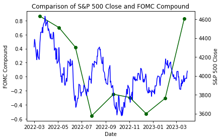 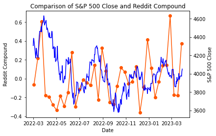

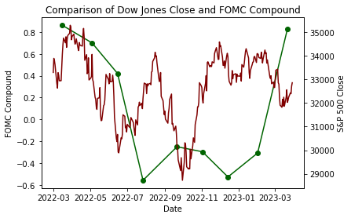 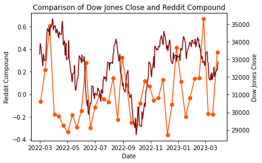

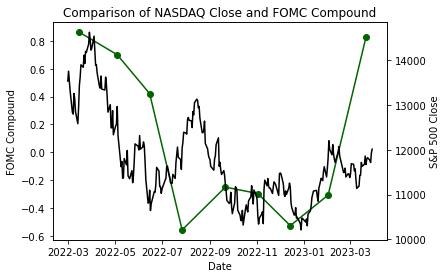 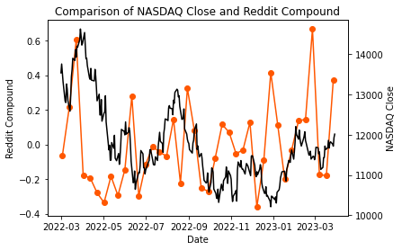

### Graph 3. Word clouds 

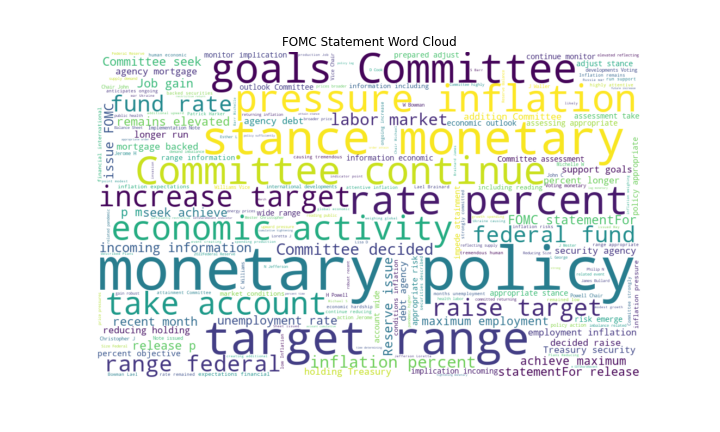 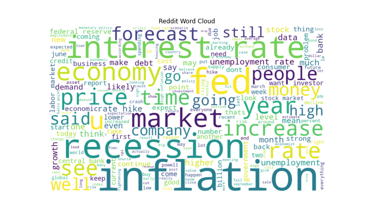

### Graph 4. Distribution of compound sentiment scores 

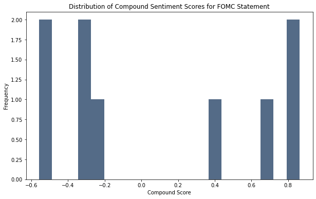 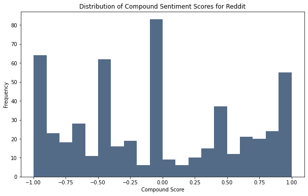

### Graph 5. Times series of compound sentiment scores 

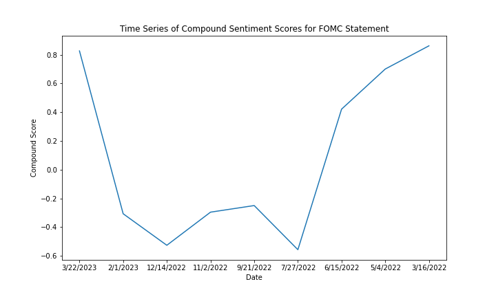 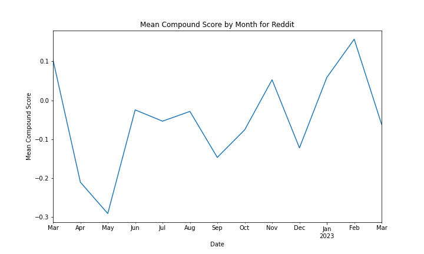

### Graph 6. TOP20 Bigrams by Frequency 

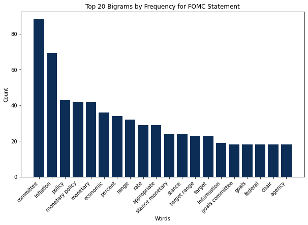 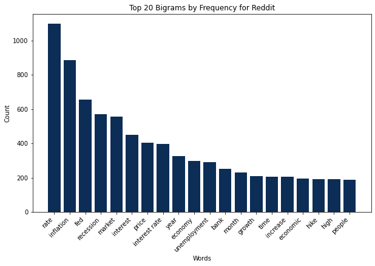

### Regression Summary Table

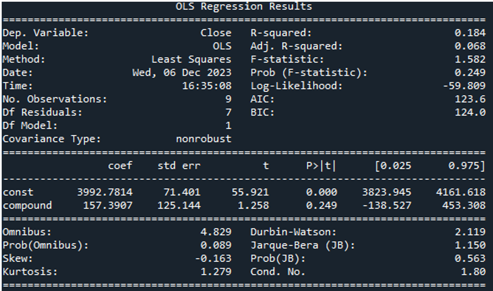 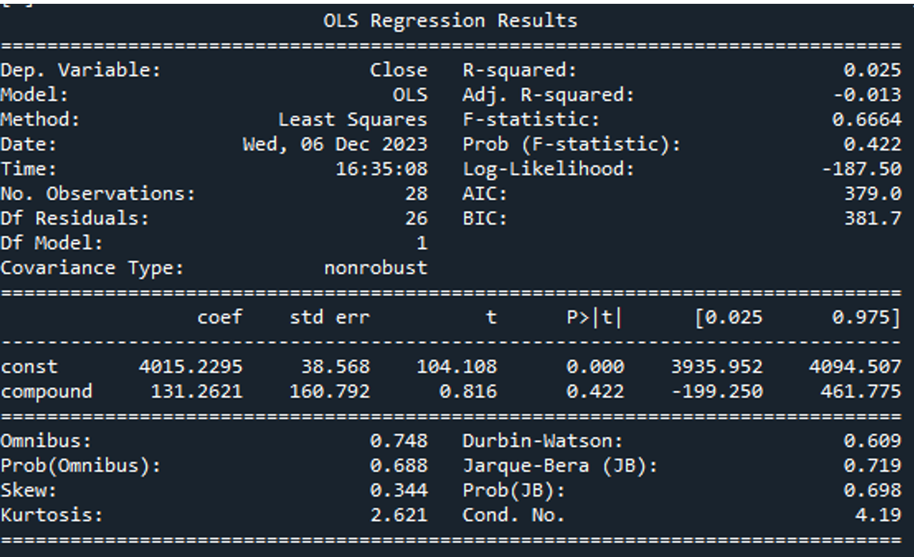

[^1]: On render and Dash package https://final-project-redditpower.onrender.com/ 
